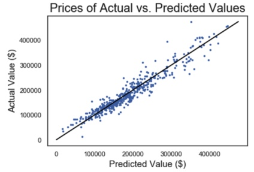

#  Project 2: Ames Housing Data and Kaggle Challenge

### Project Overview

The purpose of this project is to create a Linear Regression Model and predict the sales price for each house. For each Id in the test set, the model will predict the value of the SalePrice variable. The predictions will be submitted unto Kaggle.

### Evaluation

Kaggle leaderboard standings will be determined by root mean squared error (RMSE).

### Data Set Used

There are three files:

- **train.csv** -- this data contains all of the training data for your model.
  - The target variable (`SalePrice`) is removed from the test set! 
- **test.csv** -- this data contains the test data for your model. You will feed this data into your regression model to make predictions.
- **sample_sub_reg.csv** -- An example of a correctly formatted submission for this challenge (with a random number provided as predictions for `SalePrice`. Please ensure that your submission to Kaggle matches this format.

## **Data Cleaning**

Many of the columns had NaN values in them.

- Rows that had a NaN value as a string, I used Mean/ Mode/ Median imputation to clean up the data set. The pros of this method is that it is very easy to implement and understand. The cons of this method is that it significantly distorts histogram and underestimates variance.

- Specifically, I have cross checked the imputed data to minimise any such forms of distortion or underestimation so as to minimise the negative implications from this model.

Outliers:

- While looking at my outliers post-modeling, I noticed that some properties were huge with many rooms and bathrooms but were sold at an extremely low price. I decided to drop these outliers.
- There were other outliers that were identified as outliers in multiple categories. These outliers were also dropped.

## **Model Process**

1. I dummied out every single categorical column in both train and test data.
2. I split my training data into one part that I could use to train my model and the other party so I could test it. In order to not clash with my original test data, I labeled this new test data as "holdout."
3. Identified variables I want to include my model.

- I first started by determining which variables are definitely important to determining sale price of a property.
- I created a for-loop that made Single Linear Regressions for each individual variable against Sale Price and added that variable name to a list if it affects sale price by at least +/- 30,000.

4. I ran my model and obtained the scores of the training set, the holdout set, and a cross value score of the training set.

5. I used PolyNomialFeatures to create interactions of every numerical column in my original dataset. I used Lasso to identify which interactions were the most effective and I added those to my Linear Regression Model and re-ran it.

## **Summary**

My submission was made on Kaggle. My best model has a Root Mean Squared Error of $30,145.12 against the Kaggle test data.

The following are scores obtained from my training and holdout data:

| Metric                                      | Score      |
| ------------------------------------------- | ---------- |
| **R2 Score (Train Data)**                   | 91.92%     |
| **R2 Score (Holdout Data)**                 | 91.63%     |
| **Cross Value Score, 5 Folds (Train Data)** | 84.76%     |
| **Root Mean Squared Error**                 | $22,473.26 |
| **Mean Absolute Error**                     | $16,249.43 |
| **Mean of Residuals**                       | -$450.86   |

## Contact

**Team Lead (Contact) : [Samuel Cheong](https://github.com/samcheongjy)(@SamuelCheong)**

